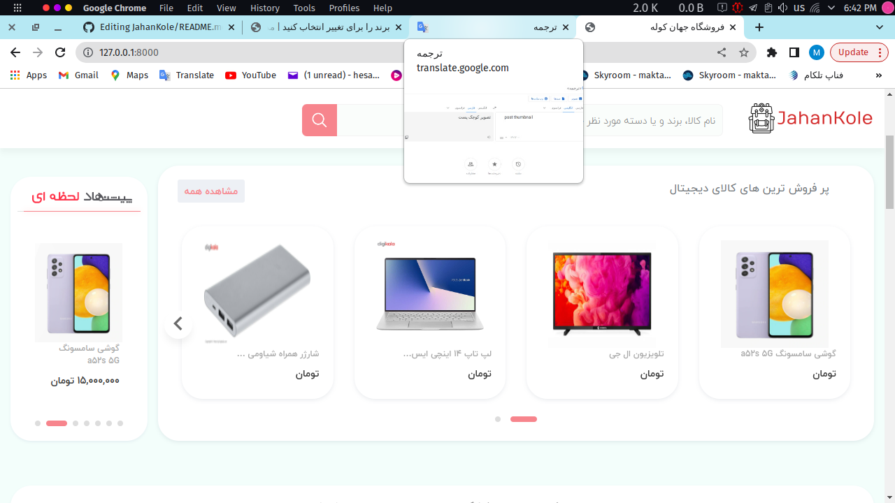
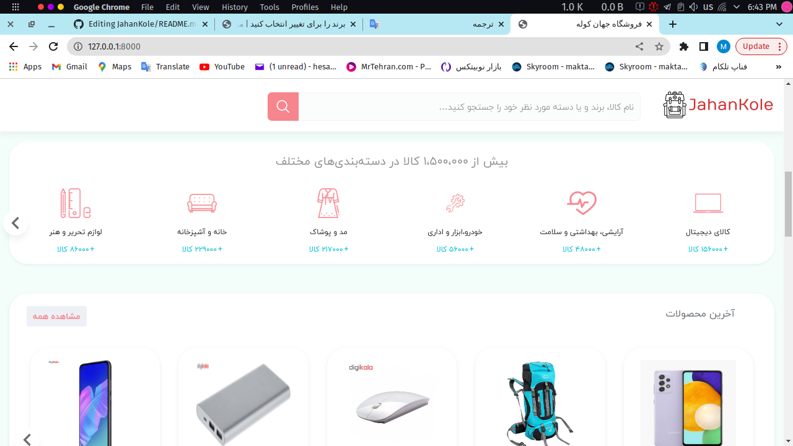
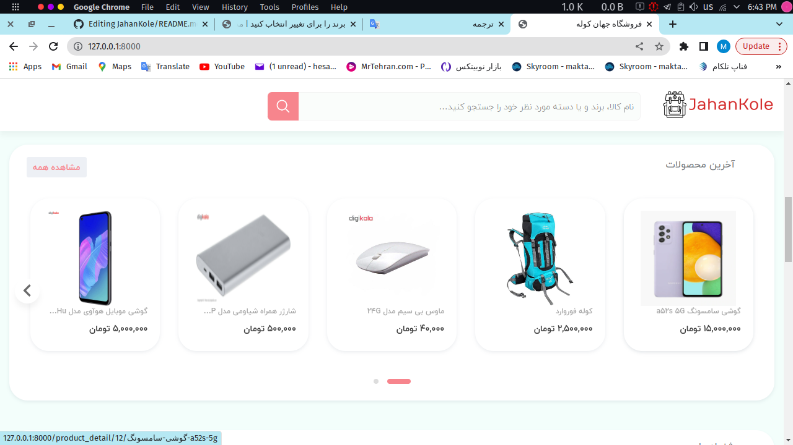
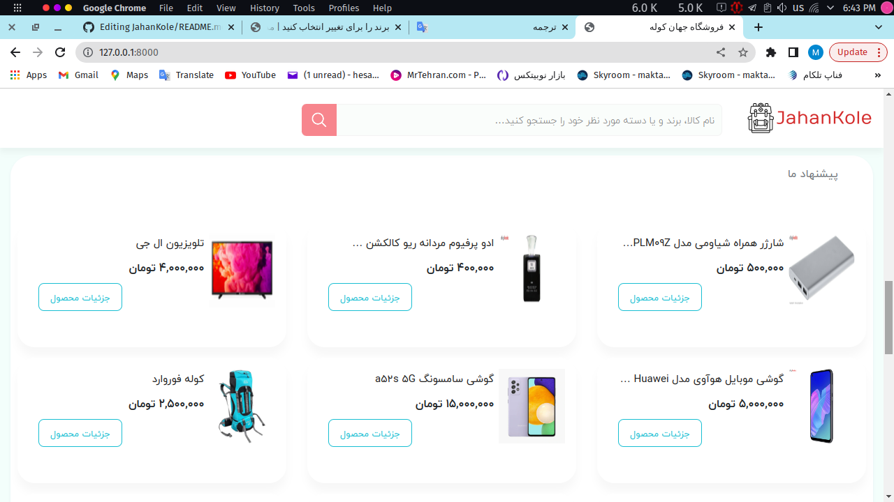

# Jahankole

Django Ecommerce | Build Advanced Django Web Application
<br>
in **Django** Framework.

<hr>

This is a advanced e-commerce website like Digikala built with Django framework.
The website displays products. Users can add and remove products to/from their cart while also specifying the quantity of each item. They can then enter their address and choose Stripe to handle the payment processing.

<br>

### Screenshots

<table>
  <tr>
  <td align="center">
      <a href="https://github.com/Hesamnik/JahanKole/blob/master/screenshots/Screenshot_106.png">
        
      </a>
      <br />
      <p>home page</p>
    </td>
    <td align="center">
      <a href="https://github.com/Hesamnik/JahanKole/blob/master/screenshots/2.png">
        
      </a>
      <br />
      <p>products</p>
    </td>
    <td align="center">
      <a href="https://github.com/Hesamnik/JahanKole/blob/master/screenshots/3.png">
        
      </a>
      <br />
      <p>account</p>
    </td>
    <td align="center">
      <a href="https://github.com/nimadorostkar/Didikala/blob/master/screenshots/4.png">
        
      </a>
      <br />
      <p>orders</p>
    </td>
    <td align="product pag">
      <a href="https://github.com/nimadorostkar/Didikala/blob/master/screenshots/5.png">
        
      </a>
      <br />
      <p>product page</p>
    </td>
    </tr>
</table>

### Clone this repository

```
https://github.com/Hesamnik/JahanKole.git
```

### Install Dependencies
```
pip install -r requirements.txt

```
### Run the following commands to get started:

```
python manage.py makemigrations
python manage.py migrate --run-syncdb
python manage.py runserver
```
